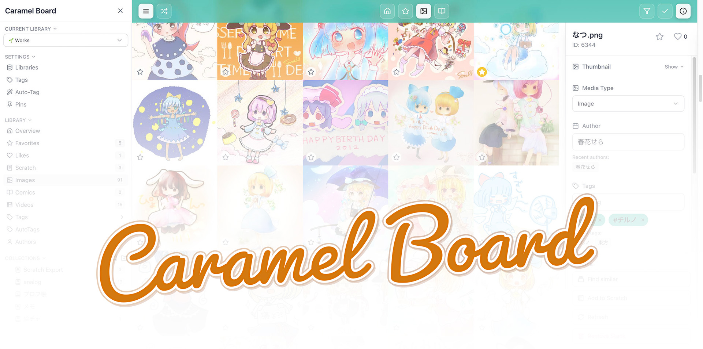

# CaramelBoard 🍬🤎



[English version is here → README.en.md](./README.en.md)

CaramelBoardは、画像・動画などのアセットをローカルで収集・整理するためのプライベートなWebアプリです。お使いのPCで動いて、ブラウザやLAN内の他のPC、スマホ・タブレットからアセットを快適に見ることができます。

このアプリは [nazunya](https://x.com/na_zu_nya) がゆるやかに個人開発しています。全体的にVibeCodingです。少しづつ整えていきたいです。
安定版は main ブランチ、開発版は dev ブランチに上がってます。 dev は新機能が早いけど、バグがあるかもです。自己責任で!

#### 主な特徴

- ドラッグ&ドロップで簡単にたくさんのアセットを取り込み・整理
- 画像、漫画（複数ページ）、動画を快適に閲覧
- 完全にローカル動作・外部送信なし。 プライベートなデータ管理
- 複数ライブラリ、タグ・作者設定、色抽出、(オプション)自動タグ付け、お気に入りなどなど、便利な検索・切り出し機能

#### 構築の難しさ

- **Web開発者:** ★★・・・ (比較的かんたんです)
- **PCに慣れてる人:** ★★★・・ (ややむずかしいです)

※セットアップ・起動はコマンドラインを使います。ちょっと難しいです！

## ご利用前に

#### ライセンス・使用範囲・保証について

本ソフトウェアは [**Elastic License 2.0 (ELv2)**](https://www.elastic.co/licensing/elastic-license) で提供しています。

- 個人・法人を問わず、**自宅／社内での利用（商用含む）** が可能です。
- **第三者向けのホステッド／マネージドサービスとしての提供はできません**（SaaSは不可です。必要な場合は個別許諾をご相談ください）。
- 本ソフトは**AS IS**で提供され、明示・黙示を問わずいかなる保証も行いません。

特にユーザ制限など設定してないため、インターネット上に直接公開するのはとっても危険です。管理できる範囲内で運用してください。

#### AIに慎重の立場の方へ

**自動タグ付けについて**

自動タグ付けは、登録されたアセットを分析して、自動的に作品の特徴タグを生成する機能です。この機能は事前にトレーニングされたモデルを使用します。 有効にすることで、検索やスマートコレクションに利用したり、類似画像を検索したりすることができます。

- **デフォルトでは無効**になっています。必要な方はセットアップ時に有効化してください。
- 有効化すると、**第三者が配布するローカル推論ライブラリ** をダウンロードします。外部ライブラリの学習データやライセンスについての確認は利用者の責任において行なってください。
- この機能は、登録された画像をローカルで解析して、**タグを推定する用途のみ**に使っています。 **新規生成・学習・外部送信は行いません。
- 懸念がある場合、自動タグ付けを使用せず、手動のタグ機能をご活用ください。

**開発について**

このソフトウェアは、一般的なAIコーディングツールの支援を受けて開発されています。

## セットアップガイド

### Windows / macOS

- Windows: [docs/installation-windows.md](./docs/installation-windows.md)
- macOS: [docs/installation-macos.md](./docs/installation-macos.md)

各プラットフォーム向けの詳細な手順は上記ドキュメントをご確認ください。

### Linux クイックスタート

#### 前提ソフト

- Docker Engine と docker compose plugin
- Git
- Python 3（3.10 以上推奨）

> `huggingface-hub` を利用するため、pip が利用可能な状態であることを確認してください。

#### リポジトリの取得

```bash
git clone https://github.com/na-zu-nya/caramel-board.git caramel-board
cd caramel-board
```

#### 初期セットアップ

```bash
chmod +x setup.sh serve.sh scripts/*.sh
python3 -m pip install --upgrade pip
python3 -m pip install huggingface-hub
./setup.sh
```

- 先に `pip` と `huggingface-hub` を用意しておくことで、セットアップ中に必要なライブラリを利用できます
- `./setup.sh` の途中で保存先やオプションについて質問されるので、案内に従って選択します

#### 起動と停止

```bash
# 本番モードで起動
./serve.sh prod

# 開発モードで起動
./serve.sh dev

# サービスの停止
./serve.sh stop
```

アプリが起動すると `http://localhost:6766` または `http://<ホストIP>:6766` からアクセスできます。

#### 更新

```bash
./serve.sh update
```

最新の変更を取り込んで再ビルドし、必要に応じて再起動します。

## バックアップ

### ストレージ（画像/動画・DBの置き場所）

- 推奨の既定（ローカル上書き用）
  - 画像・動画（アプリの `/app/data`）: リポジトリの `./data/assets`
  - PostgreSQL データ: リポジトリの `./data/postgres`
- `docker-compose.local.yml` を使って上書きできます（存在すれば `./serve.sh` が自動で読み込みます）。

例（推奨の既定をそのまま使う）

```yaml
services:
  app:
    environment:
      - FILES_STORAGE=/app/data
    volumes:
      - ./data/assets:/app/data
  postgres:
    volumes:
      - ./data/postgres:/var/lib/postgresql/data
```

Windows/WSL の例（任意の場所に保存したい場合）

権限エラーが出る場合は、ホスト側ディレクトリの所有権/パーミッションを調整してください。

## トラブルシューティング

- 6766 番ポートを他のサービスが使っている → docker-compose.yml の `ports` 設定を変更し、`./serve.sh` を再実行
- PostgreSQL 5432 が使用中（開発利用時） → docker-compose.dev.yml の `ports` を変更
- JoyTag に接続できない → `curl http://localhost:5001/health` で確認し、`JOYTAG_SERVER_URL` を点検
- ストレージ権限エラー → ホスト側ディレクトリの所有権/パーミッションを修正

## ライセンス / 貢献 / 開発者向け

- バグやリクエストはIssueでお願いします(フォーマット準備中)
- PR は 現在承認済みメンテナのみ受け付けています。将来的にオープンにするかもです。
